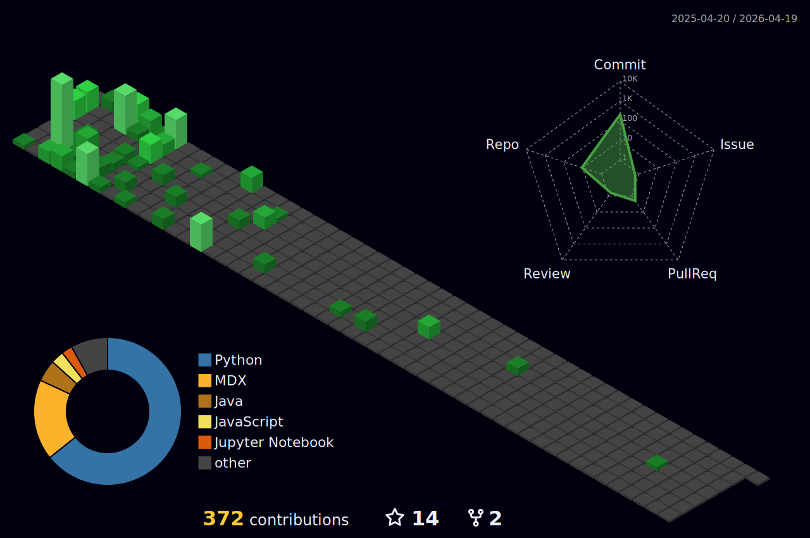

# 🐙 Octo-Stats

**Octo-Stats** is a **GitHub template repository** designed to help users display their **GitHub statistics** in a more dynamic and visually appealing way using **GitHub Actions**. 

This repo is a **curated collection** of workflows sourced from various open-source projects, making it easier for users to set up and enhance their GitHub profiles. 

## ✨ Features  
✅ **Pre-configured GitHub Actions** – Automate fetching and updating your GitHub stats effortlessly.  
✅ **Easy Integration** – Just copy the template, update your GitHub profile, and enjoy automated updates.  
✅ **Dynamic Display** – Your stats refresh automatically based on a scheduled cron job. ⏳  
✅ **Curated & Optimized** – Carefully selected workflows from different repositories for efficiency. 💡  

---  

## 📌 Get Started  
### 🔧 Create Your Own Repository  
Create a new repository using this template or **[Click Here](https://github.com/new?template_name=octo-stats&template_owner=nishant-sheoran)** to generate one instantly!  

### 📊 Example SVG Stats  
Check out some cool stats that this template can generate:  

🔗 *To explore themes and for more details, check out the main repo*  

🖥️ **[GitHub Stats](https://github.com/yogeshwaran01/github-stats-terminal-style)**  

  

🕹️ **[3D Contribution Graph](https://github.com/yoshi389111/github-profile-3d-contrib)**  

  

🐍 **[Snake Contribution Graph](https://github.com/Platane/snk)**  

  <picture>
    <source media="(prefers-color-scheme: dark)" srcset="dist/github-snake-dark.svg" />
    <source media="(prefers-color-scheme: light)" srcset="dist/github-snake.svg" />
    
  </picture>

---  

## 🔑 Setting Up Personal Access Token (PAT)  
A **Personal Access Token (PAT)** is like a password 🔐 that allows applications (such as GitHub Actions) to authenticate and perform actions on your behalf.  

### 📝 Steps to Create a PAT:  
1️⃣ Go to **Settings** → **Developer settings** → **Personal access tokens**.  
2️⃣ Click on **Generate a new token (classic)**.  
3️⃣ Select the required scopes:  
   - ✅ `repo` → Full control of private repositories (needed to push updates).  
   - ✅ `workflow` → Allows GitHub Actions to trigger workflows.  
4️⃣ **⚠️ Important:** Copy the token as it will disappear once you leave the page.  

### 🔒 Adding the Token as a Secret  
1️⃣ Go to **Repository Settings** → **Secrets and Variables** → **Actions**.  
2️⃣ Click **New Repository Secret**.  
3️⃣ Name it **GHT** and paste the copied PAT in the input box.  
4️⃣ Save it.  

**⚠️ Security Note:** Handle your PAT **securely** 🔥, as it can be used to manipulate your repo (e.g., making commits, adding/deleting files, or even deleting the repo).  

---  

## ⚙️ Grant Workflow Permissions  
To allow GitHub Actions to commit and push changes, follow these steps:  
1️⃣ Go to your **GitHub Repository Settings**.  
2️⃣ Navigate to **Actions** under **Code and Automation**.  
3️⃣ Select **General** from the dropdown.  
4️⃣ Scroll down to **Workflow Permissions**.  
5️⃣ Choose **Read and write permissions**.  
6️⃣ Save the settings. ✅  

---  

## ▶️ Running Workflows  
🎯 **Manual Execution**  
1️⃣ Navigate to the **Actions** tab in your repository.  
2️⃣ Under **All Workflows**, select the `.yml` file you want to run.  
3️⃣ Click **Run Workflow** to manually trigger the workflow for testing.  

⏳ **Automated Execution**  
The workflows are scheduled to run **automatically at defined UTC times**.  
After a successful run, your generated files can be embedded into your **README** file. 📄  

---  

## 📜 License  
This repository is released under the **MIT License**. See **[LICENSE](LICENSE) 📄** for details.  

## 🤝 Contributing  
Contributions are welcome! Feel free to **submit pull requests** with additional workflows or improvements. 💡  

## 📬 Contact  
For any issues or feature requests, please **open an issue** on GitHub. 🚀  

---  
_This repository is actively used for personal GitHub profile updates and is now shared with the community to ease the setup process for others._ 🎉  

